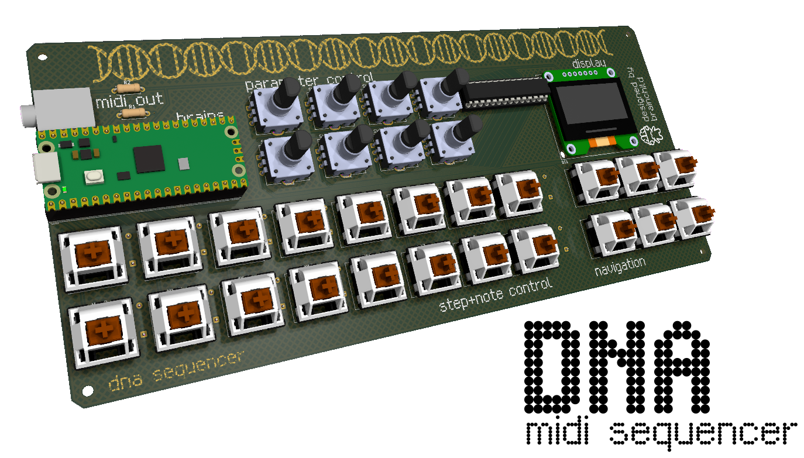

# DNA Sequencer

A flexible MIDI sequencer powered by a Raspberry Pi Pico 2 (RP2350), inspired by sequencers found in the Korg Volca and Elektron boxes. Aims to be accessible, affordable, repurposable, and expandable.

## Current features
- RPi Pico 2 microcontroller, the brains of the sequencer
- MIDI output via 3.5mm TRS
- 16 keys for step editing, note input, or other custom macros
- 6 keys for navigation (get ready to menu dive!)
- 8 incremental encoders for CC/parameter adjustment and macros
- 128x64 1.3" OLED display
- All components are through-hole for easy soldering, and readily available

## Why'd you make this?
Currently the options for standalone hardware MIDI sequencers are either budget sequencers that do not have a vast featureset and, at least to myself, were limiting in terms of potential creativity, or more feature rich sequencers which cost a couple arms and legs. I wanted to make a device that would help bridge the gap between those two mountains and leverage the power of DIY & open source in order to create an accessible, affordable, repurposable, and expandable hardware sequencer. Additionally, this project serves as my first 100% serious hardware project, so all of the processes I learn throughout the journey of creating this device will be invaluable to me and whatever future endeavours lie before me... learning is fun!
