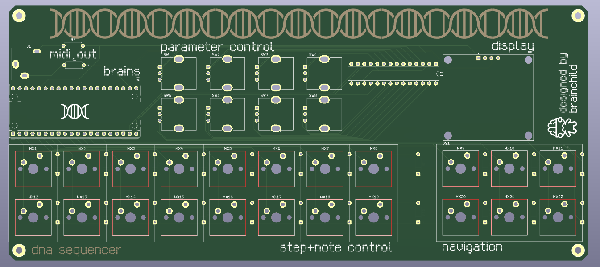

# DNA Sequencer

A flexible MIDI sequencer powered by a Raspberry Pi Pico 2 (RP2350), inspired by sequencers found in the Korg Volca and Elektron boxes. Aims to be accessible, affordable, repurposable, and expandable.

## Current features
- RPi Pico 2 microcontroller, the brains of the sequencer
- MIDI output via 3.5mm TRS, or USB
- 16 keys for step editing, note input, or other custom macros
- 6 keys for navigation (get ready to menu dive!)
- 8 incremental encoders for CC/parameter adjustment and macros
- 128x64 1.3" OLED display
- All components are through-hole for easy soldering, and readily available

## Planned features
- 8 polyphonic tracks with different modes to facilitate various types of sequencing (e.g drum, chord, arp, euclidian, etc etc), can be assigned to any 16 MIDI channels
- 64 step sequencer with the ability to sequence 8 CC parameters, variable length, microtiming, and randomization/generation features
- 16 patterns with chaining

## Why'd you make this?
Currently the options for standalone hardware MIDI sequencers are either budget sequencers that do not have a vast featureset and, at least to myself, were limiting in terms of potential creativity, or more feature rich sequencers which cost a couple arms and legs. I wanted to make a device that would help bridge the gap between those two mountains and leverage the power of DIY & open source in order to create an accessible, affordable, repurposable, and expandable hardware sequencer. Additionally, this project serves as my first 100% serious hardware project, so all of the processes I learn throughout the journey of creating this device will be invaluable to me and whatever future endeavours lie before me... learning is fun!

## Images/Videos
PCB

Schematic

## Bill of Materials

Choice of keycaps is up to you, as long as they're compatible with Cherry MX. You will also need a Micro USB cable for power and USB MIDI, and a 3.5 TRS to DIN converter for regular MIDI

|Item                   |Description                  |Quantity|Unit Price ($)|Total Price ($)|URL                                                  |Total |
|-----------------------|-----------------------------|--------|--------------|---------------|-----------------------------------------------------|------|
|MBB02070C1009FCT00     |10 Ohm resistor              |5       |$0.1346       |$0.6730        |https://www.lcsc.com/product-detail/C1364448.html    |$0.6730|
|MBB02070C3309FCT00     |33 Ohm resistor              |5       |$0.0748       |$0.3740        |https://www.lcsc.com/product-detail/C1366513.html    |$1.05 |
|MCP23017-E/SP          |I/O expander (I2C)           |1       |$2.8158       |$2.8158        |https://www.lcsc.com/product-detail/C4992459.html    |$3.86 |
|PEC12R-4120F-S0012     |Rotary encoder               |8       |$1.8791       |$15.0328       |https://www.lcsc.com/product-detail/C143801.html     |$18.90|
|SJ1-3533NG             |3.5mm TRS jack               |1       |$1.6565       |$1.6565        |https://www.lcsc.com/product-detail/C4992459.html    |$20.55|
|KH-2.54FH-1X20P-H8.5   |Socket (20 pins)             |5       |$0.1722       |$0.8610        |https://www.lcsc.com/product-detail/C2905423.html    |$21.41|
| PH2.54-1X20P-H25      |Header (20 pins)             |5       |$0.0488       |$0.2440        |https://www.lcsc.com/product-detail/C42431804.html   |$21.66|
|IC-28P                 |DIP socket                   |17      |$0.0510       |$0.8670        |https://www.lcsc.com/product-detail/C5289491.html    |$22.52|
|M3x10+6Cu              |Standoffs                    |10      |$0.0387       |$0.3870        |https://www.lcsc.com/product-detail/C551322.html     |$22.91|
|hexagon NUT M3         |Hex nut                      |100     |$0.0017       |$0.1700        |https://www.lcsc.com/product-detail/C133377.html     |$23.08|
|1N4148                 |Diodes                       |50      |$0.0116       |$0.5800        |https://www.lcsc.com/product-detail/C402212.html     |$23.66|
|SH1106                 |OLED display module          |1       |$3.6800       |$3.6800        |https://www.aliexpress.com/item/1005006072386746.html|$27.34|
|MIDI DIN to 3.5mm TRS  |DIN/TRS converter cable      |1       |$8.2000       |$8.2000        |https://www.aliexpress.com/item/1005009365055437.html|$35.54|
|Ugreen Micro USB Cable |Micro USB for microcontroller|1       |$2.6900       |$2.6900        |https://www.aliexpress.com/item/32391749504.html     |$38.23|
|XDA Profile PBT Keycaps|1U keycaps (30pcs)           |1       |$5.4100       |$5.4100        |https://www.aliexpress.com/item/1005005514406952.html|$43.64|
|11mm Potentiometer Knob|Knobs for encoders (10pcs)   |1       |$2.1000       |$2.1000        |https://www.aliexpress.com/item/1005003991686731.html|$45.74|
|Gateron Switches KS9   |Key switch (30pcs)           |1       |$12.9500      |$12.9500       |https://www.aliexpress.com/item/1005007474127225.html|$58.69|
|RPI Pico 2             |Microcontroller              |1       |$8.9800       |$8.9800        |https://www.aliexpress.com/item/1005008201547951.html|$67.67|
|JLCPCB                 |PCB x 5 and shipping costs   |1       |$24.42        |$24.42         |                                                     |$92.09|
|LCSC                   |LCSC shipping costs          |1       |$8.84         |$8.84          |                                                     |$100.93|

